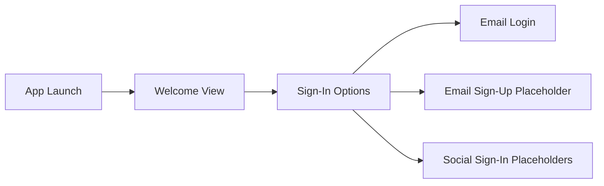

# Online Shopping — SwiftUI


A SwiftUI grocery-shopping UI prototype focused on onboarding, authentication entry points, custom styling, and organizing an iOS project around an MVVM-oriented structure.

This repository is intentionally presented as a **learning project and UI foundation**, not as a production-ready commerce application. It currently demonstrates the opening experience of the app while leaving networking, real authentication, product data, checkout, and persistence for a future iteration.

## What is included

- Full-screen grocery onboarding experience
- Welcome, sign-in, and login screen foundations
- Email sign-in and sign-up entry points
- Google and Facebook sign-in button treatments
- Custom colors defined from hexadecimal values
- Custom typography helpers
- Reusable screen-size, safe-area, and rounded-corner utilities
- Separate folders for views, view models, extensions, and assets
- Unit-test and UI-test targets scaffolded in the Xcode project

## Current flow



## Screens

### Welcome

Introduces the grocery-shopping experience with branded imagery, custom typography, and a primary call to action.

### Sign-in options

Presents separate paths for email sign-in, email registration, Google, and Facebook. The social providers are currently visual placeholders and are not connected to authentication services.

### Login

Provides the visual foundation for the email login experience. Form handling and validation are planned rather than represented as completed functionality.

## Architecture

The repository uses an **MVVM-oriented project structure**:

```text
OnlineShopping_SwiftUI/
├── Assets.xcassets
├── Extensions/
│   └── Extensions.swift
├── View/
│   ├── WelcomeView.swift
│   ├── SignInView.swift
│   └── LoginView.swift
├── ViewModels/
│   └── MainViewModel.swift
└── OnlineShopping_SwiftUIApp.swift
```

The view-model layer is currently scaffolded but not yet integrated with application state. This keeps the repository honest about its present scope while preserving a clear direction for future development.

## Technical focus

This project gave me hands-on practice with:

- Building interfaces declaratively with SwiftUI
- Composing layouts with `ZStack`, `VStack`, `ScrollView`, and `Spacer`
- Using `NavigationLink` to model an onboarding flow
- Managing local view state with `@State`
- Creating shared `Color`, `Font`, `CGFloat`, and `View` extensions
- Working with asset catalogs and custom fonts
- Separating UI code from future presentation and business logic
- Reviewing tutorial code critically instead of treating every demonstrated pattern as production-ready

## Engineering notes

A production-focused follow-up would prioritize:

1. Adding a root `NavigationStack` and defining the flow with typed navigation destinations
2. Replacing global `UIScreen` sizing with container-relative SwiftUI layout
3. Extracting the repeated authentication buttons into reusable components
4. Introducing observable authentication state and dependency injection
5. Adding input validation, loading states, and user-facing error handling
6. Supporting Dynamic Type, VoiceOver, localization, and multiple device sizes
7. Adding meaningful unit tests and UI tests
8. Connecting the app to a real API and secure authentication provider

## Requirements

The project is currently configured with:

- Xcode 26
- iOS 26 deployment target
- SwiftUI
- No third-party package dependencies

## Running the project

1. Clone the repository:

   ```bash
   git clone git@github.com:Cevalloa/OnlineShopping_SwiftUI.git
   ```

2. Open `OnlineShopping_SwiftUI.xcodeproj` in Xcode.
3. Select an iPhone simulator.
4. Build and run with **Command + R**.

Custom Gilroy font files must remain included in the application target for the typography helpers to render as intended.

## Screenshots


